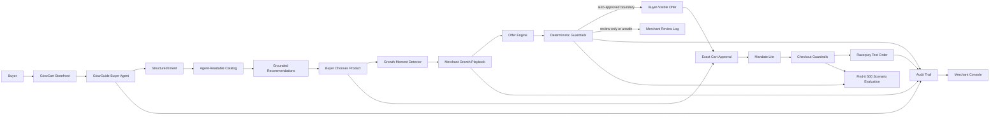

# GlowCart Agentic Commerce

GlowCart is a reusable agentic-commerce engine for Razorpay merchants. A buyer-facing shopping agent grounds recommendations in the merchant catalogue, while an editable Growth Playbook decides which upsells, cross-sells, bundle switches, and deal requests are allowed. Buyer-visible offers still require exact-cart approval before Razorpay Test Mode checkout. Unsafe, off-playbook, or review-only opportunities are withheld from the buyer and recorded in the merchant audit trail.

The application lives in [`agentic-commerce`](./agentic-commerce).

## Local Development

```bash
cd agentic-commerce
npm ci
cp .env.example .env.local
npm run dev
```

Open `http://localhost:3000`.

Useful routes:

```text
/           Retail landing page
/login      Buyer sign-in
/shop       Catalogue + GlowGuide buyer agent
/cart       Optional cart inspection
/merchant   Growth Playbook, opportunities, and audit trail
/findit     500-scenario Find-it evaluation dashboard
```

## Verification

```bash
npm test
npm run lint
npm run build
npm run test:e2e
```

The Find-it suite currently runs 500 deterministic synthetic scenarios, including 20 critical adversarial financial tests for amount tampering, cart mutation, stale prices, zero inventory, duplicate checkout, expired buyer approval, unsafe claims, unsupported products, over-budget carts, and review-only deal requests. Every case is individually inspectable at `/findit`.

## Render Deployment

This repository includes a root-level [`render.yaml`](./render.yaml). Create a Render Blueprint from the repository and enter the environment variables that Render prompts for. This project must be deployed as a **Node web service**, not a static site, because it contains server-side agent, voice, checkout, and payment-verification routes.

Required connected-provider variables:

```text
OPENAI_API_KEY
RAZORPAY_KEY_ID
RAZORPAY_KEY_SECRET
NEXT_PUBLIC_RAZORPAY_KEY_ID
ELEVENLABS_API_KEY
ELEVENLABS_VOICE_ID
```

Never commit `.env.local` or provider secrets.

## Product And Architecture

- [`Final architecture`](./agentic-commerce/docs/final-architecture-spec.md)
- [`Implementation audit`](./agentic-commerce/docs/implementation-audit.md)
- [`Build playbook`](./agentic-commerce/docs/build-playbook.md)
- [`Product strategy`](./agentic-commerce/docs/track-01-agentic-commerce-strategy.md)

## Architecture Snapshot


