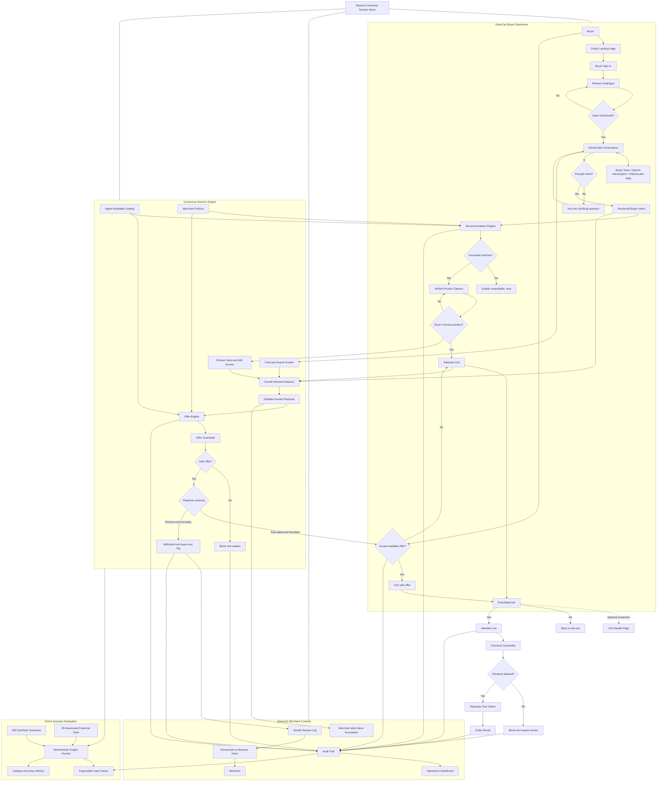

# Final Architecture Spec: Agentic Commerce Engine

Date: 2026-09-03

## Final Idea

We are building a reusable agentic commerce engine for Razorpay merchants. The retail site remains a normal catalogue until a signed-in buyer deliberately opens the guided shopping agent. The agent turns a vague need into grounded product options, not an automatic cart. Only the buyer's product choice creates cart events and starts growth evaluation. The merchant-configured Growth Playbook is the authority for growth actions: auto-approved boundaries may be shown to buyers, while review-only or unsafe opportunities are withheld and logged for the merchant. Every offer and payment action passes deterministic guardrails, requires buyer approval for the final cart, creates a Razorpay test-mode order, and logs the full audit trail.

## Mermaid Architecture



## Agent Roles

### Buyer-Facing Guided Shopping Agent

Purpose:

- Talk to the buyer.
- Ask clarifying questions.
- Convert vague buyer needs into structured intent.
- Recommend a small number of suitable products.
- Explain selected and rejected products.

Uses:

- LLM for conversation, intent extraction, and explanation.
- Catalog and policy data as grounding.
- Recommendation engine for product choice.

Does not:

- Create Razorpay orders.
- Override price, stock, offer, or approval rules.
- Invent product claims.

### Growth Copilot

Purpose:

- Help the merchant grow live-session revenue safely.
- Detect growth moments from first-party commerce session events.
- Propose safe offers from the Growth Playbook.
- Speak or display merchant-facing suggestions.

Uses:

- Growth Moment Detector.
- Growth Playbook.
- Offer Engine.
- Voice output for demo.

Does not:

- Track external browsing.
- Chase abandoned carts as the main workflow.
- Show review-only or unsafe opportunities to the buyer.
- Replace buyer approval.

### Offer Engine

Purpose:

- Convert a detected growth moment into a concrete offer proposal.

Uses:

- Product graph.
- Merchant-configured offer rules.
- Cart state.
- Buyer constraints.
- Policy data.

Examples:

- gift note cross-sell
- routine-gap sunscreen cross-sell
- bundle switch
- discount only with stricter approval

### Guardrail Engine

Purpose:

- Deterministically decide whether a cart, offer, or checkout action is allowed.

Checks:

- budget
- stock
- quantity
- category
- current price
- unsupported claims
- approval state
- expiry
- cart hash
- duplicate checkout

### Mandate Lite

Purpose:

- Bind buyer intent, final cart, approved amount, cart hash, expiry, and checkout usage before Razorpay order creation.

This is our hackathon-sized version of agent-payment authorization.

## Tooling Choices By Stage

| Stage | What happens | Tool / technology |
|---|---|---|
| Retail entry | Buyer lands, signs in, and browses normally | Separate Next.js `/`, `/login`, and `/shop` routes |
| Buyer chat | Buyer deliberately opens the assistant and answers questions | Optional drawer on `/shop` + OpenAI buyer-agent adapter + deterministic fallback |
| Intent extraction | Convert language into budget, recipient, use case, constraints | OpenAI Responses structured output, normalized into deterministic engine input |
| Product recommendation | Return only in-stock, in-budget, policy-referenced catalog options | TypeScript recommendation engine; zero-match requests are stopped |
| Session events | Record only actions that occurred in the first-party store | TypeScript event model; product events begin after buyer choice |
| Growth moment detection | Find gift intent, routine gaps, bundle opportunities | TypeScript rules |
| Offer decision | Choose eligible cross-sell/upsell/bundle/discount | Editable Growth Playbook + product graph passed into the engine |
| Offer safety | Block irrelevant, over-budget, unsupported, or risky offers | Deterministic guardrails |
| Merchant console | Configure playbook boundaries and review logs | Admin UI + voice/readout of withheld opportunities |
| Voice | Let buyers speak and hear the commerce conversation; voice the merchant brief | OpenAI audio transcription + ElevenLabs TTS; browser TTS fallback |
| Buyer approval | Confirm final cart and exact amount inside GlowGuide; keep `/cart` optional | Context-bound text/voice approval or explicit button + Mandate Lite |
| Payment action | Create test-mode payment order | Razorpay Orders API |
| Proof | Show all decisions/actions | Audit trail + merchant dashboard |
| Scenario evaluation | Test whether the engine follows core commerce safety rules | Find-it dashboard with 500 inspectable synthetic scenarios and adversarial financial tests |

## API Keys Needed

Required for real payment flow:

```text
RAZORPAY_KEY_ID
RAZORPAY_KEY_SECRET
NEXT_PUBLIC_RAZORPAY_KEY_ID
```

Required for LLM agent behavior:

```text
OPENAI_API_KEY
```

Required for connected buyer and merchant voice:

```text
ELEVENLABS_API_KEY
```

If ElevenLabs is not configured, use browser text-to-speech as fallback.

## Growth Playbook Source Of Truth

The Growth Playbook should not be made from generic LLM knowledge.

It should be inspired by common ecommerce rule patterns:

- related recommendations
- complementary recommendations
- frequently bought together
- cart value thresholds
- automatic discounts
- discount codes
- product exclusions
- offer start/end dates
- maximum uses
- margin-sensitive approval
- offer stacking limits

Initial playbook rules:

```text
Gift note cross-sell:
If gift intent is detected and the gift note fits inside buyer budget, propose the gift note.

Routine gap cross-sell:
If the buyer is building a day routine and cart has no sunscreen, propose sunscreen if it fits budget.

Bundle switch:
If separate items are available as a better bundle, propose switching to the bundle.

Discount or high-risk deal:
Withhold from the buyer and log it unless the merchant has explicitly configured it as an auto-approved boundary with strict margin and usage limits.
```

## Voice Decision

Recommended:

- Use OpenAI audio transcription for buyer microphone input.
- Use ElevenLabs for buyer replies and the merchant growth briefing.
- Keep browser text-to-speech fallback in the app.
- Keep voice inside the web product rather than adding a phone-call channel.

Voice is an input/output adapter, not the money authority. A transcribed approval is accepted only while GlowGuide is presenting a specific final cart and exact total; deterministic guardrails still decide whether checkout may proceed.

Voice review template:

```text
Growth opportunity withheld. This shopper asked for a bigger deal. The proposed bundle fits the budget, but this boundary is review-only, so it was not shown to the buyer. Review the playbook if this should be automatic in future sessions.
```

## Implementation Status

| Capability | Current state |
|---|---|
| Separate landing, login, catalogue, cart, and merchant console | Implemented |
| Shared commerce session and cross-page decisions | Implemented in local storage; server persistence remains |
| Clarification loop | Implemented with OpenAI structured output and deterministic fallback |
| Structured intent and recommendation | Implemented; unsupported requests return no match instead of a fallback product |
| Buyer product choice before cart creation | Implemented; recommendations never auto-add themselves |
| Session events, growth detector, editable playbook, offer guardrails | Implemented and scenario-tested |
| Playbook authority and review-only logging | Implemented; auto-approved offers can reach the buyer, review-only opportunities are withheld and logged |
| Buyer offer choice and exact-cart approval | Implemented in GlowGuide by contextual text, transcribed voice, or explicit control; `/cart` remains optional |
| Mandate Lite and checkout integrity checks | Implemented |
| Razorpay test order creation | Connected and verified in test mode; mock adapter remains available without credentials |
| Buyer and merchant voice | OpenAI microphone transcription and ElevenLabs English voice connected; browser speech fallback for output |
| Audit trail and handled price-change failure | Implemented |
| LLM structured-output adapter | Implemented and verified |
| Find-it 500-scenario synthetic evaluation | Implemented at `/findit`; covers catalog grounding, claim safety, auto-growth, playbook blocks, review-only deals, cart integrity, stock recheck, and 20 adversarial financial cases |
| Individual Find-it case inspection | Implemented with expandable traces showing expected result, actual result, engine evidence, guardrail checks, audit actions, risk, and attack type |
| Durable database and authenticated merchant access | Required before production use |

## Find-it Scenario Coverage

The evaluation set is intentionally mixed between normal growth behavior and hostile commerce behavior:

- Catalog grounding: unsupported product asks must not become fake inventory.
- Claim safety: unverified safety or medical claims stop before recommendation.
- Auto growth: low-risk playbook boundaries can produce buyer-visible offers, but the cart is not changed until the buyer accepts.
- Playbook blocks: disabled merchant boundaries prevent the offer.
- Review-only deals: large or risky deal requests are withheld from the buyer and logged for merchant review.
- Cart integrity: price or cart changes after approval block checkout before a Razorpay order.
- Stock recheck: inventory changes after approval block checkout before a Razorpay order.
- Financial adversarial: amount tampering, cart mutation, duplicate checkout, expired approval, stale price, zero inventory, over-budget cart, unsafe claim, unsupported product, and review-only deal attacks.
